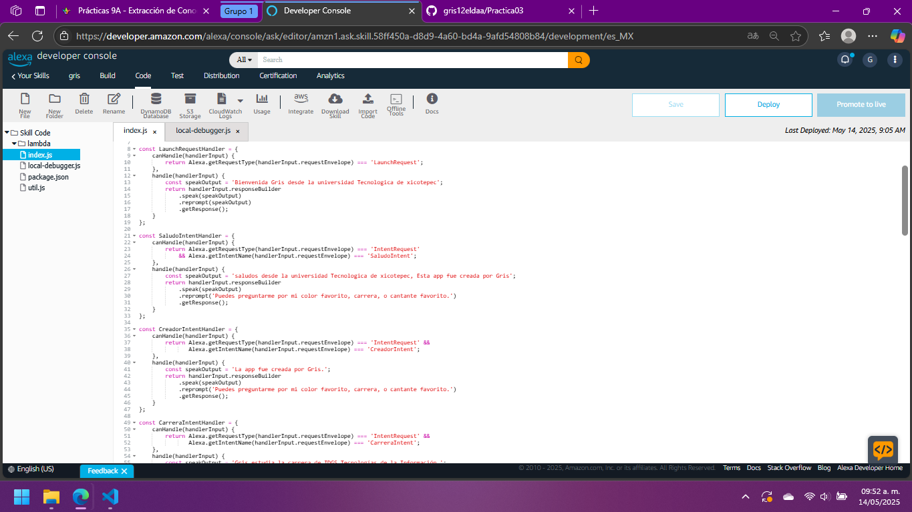

# practica:03 Matricula:220336

    
    

      

UNIVERSIDAD TECNOLÓGICA DE XICOTEPEC DE JUÁREZ

Materia: Extraccion de conocimientos de bases de datos   
Docente: Marco Antonio Ramírez Hernandez   
Alumno: Griselda Cabrera Franco   
Matrícula: 220336   

Práctica 02: Esta skill responde a 4 comandos especificos  usando el modelo de interacción de Alexa:

- ¿Quién creo la aplicación?
-¿Qué carrera estudia?
-¿Cuál es su color favorito?
-¿Cuál su grupo o cantante favorito?

 
Fecha entrega: 14 del 05 del 2025

 

### Imágenes de la APP
#### Codigo

    

#### Pruebas

    

